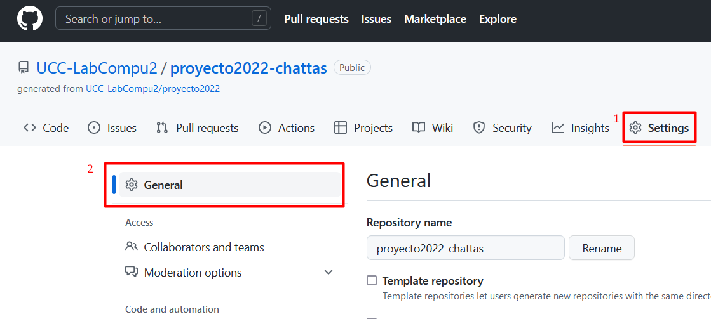
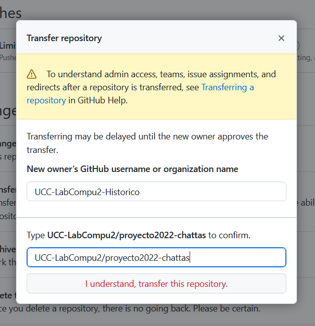
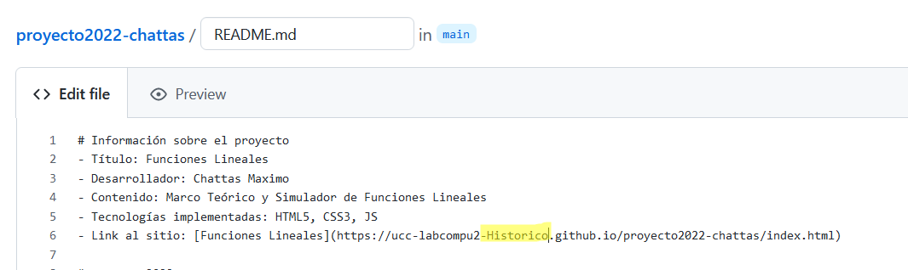

# historial-proyectos
Historial de Proyectos de Laboratorio de Computación II
https://ucc-labcompu2-historico.github.io

### Pasos para hacer la transferencia de repositorio
El siguiente procedimiento debe llevarse a cabo cuando el grupo (o el alumno en caso de ser un trabajo individual)
aprobó la meteria (final).

1. Ingresar al repositorio, en la pestaña de settings
2. Asegurarse de que está seleccionada "General"

3. Scroll hasta la sección final, y en la Danger Zone, seleccionar Transfer

4. Colocar como nombre de la organización "UCC-LabCompu2-Historico", y colocar al nombre del repositorio que se desea tranferir

5. Editar el readme para corregir la URL del repositorio (colocar el "-Historico")
